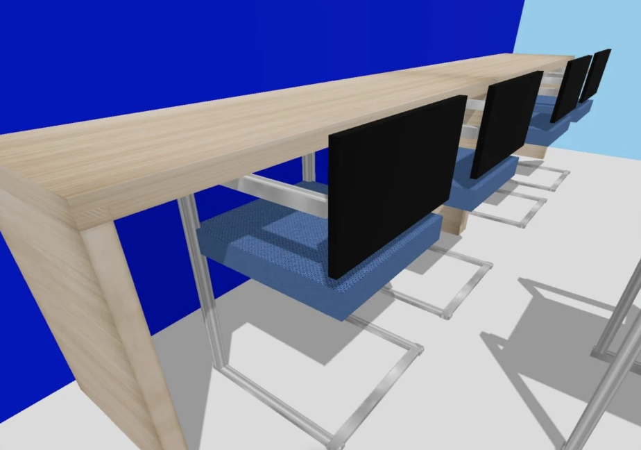
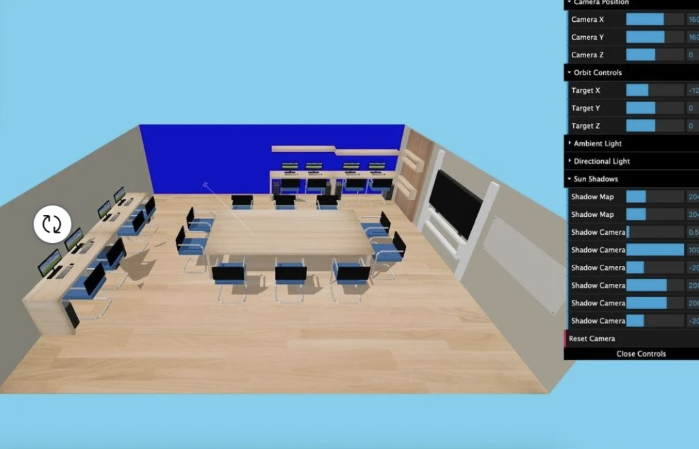
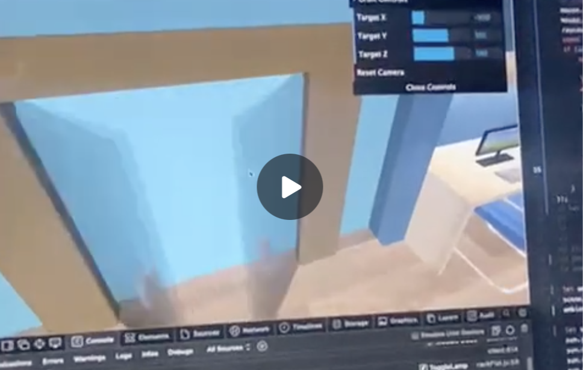
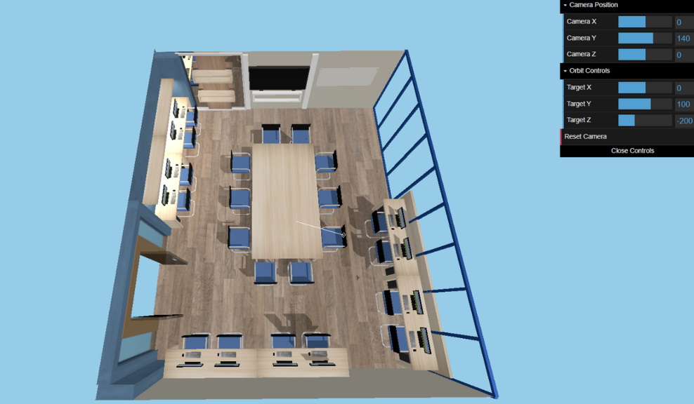

# ComputerGraphicsFP

| NRP | Name |
|-|-|
| Muhammad Aulia Triatmono | 5025221069 |
| Surya Prima Pradana | 5025221076 |
| Ralfazza Rajariandhana | 5025221081 |
| Maheswari Parisya Putri | 5025221096 |
| Radian Try Darmawan | 5025221097 |

### Setup
Install dependencies with
```
npm install --save three
npm install --save-dev vite
```
Then run with
```
npm run dev
```

### Deployment
Available online from https://alpro.ralfazza.com

### 3D Modelling
Every object is created using primitives from ThreeJS and is saved into a file such as <code>chair.js</code>, <code>pc.js</code>, and <code>TV.js</code>. Then for objects that are made up of other objects, it only need to inherit the previously made object. For example a workspace is made up of chair, table, pc, and monitor so <code>workspace.js</code> needs to inherit those objects and adjust the positions.
<code>workSpace.js</code>

```js
import * as THREE from 'three';
import { Table } from './table.js';
import { Monitor } from './monitor.js';
import { PC } from './pc.js';

class WorkSpace extends THREE.Mesh {
  constructor() {
    super();
    this.workSpace = new THREE.Group();
    let table = new Table();
    const monitor1 = new Monitor();
    const pc1 = new PC();
    const monitor2 = new Monitor();
    const pc2 = new PC();
    this.workSpace.add(monitor1,monitor2,pc2,pc2);
    this.add(this.workSpace);
  }
}
export { WorkSpace };
```

then create an instance of it by
```js
let workspace1 = new WorkSpace();
scene.add(workspace1);
```

### Transformation/Camera
```js
let renderer = new THREE.WebGLRenderer();
renderer.setSize( window.innerWidth, window.innerHeight );
renderer.setAnimationLoop( animate );
renderer.setPixelRatio(devicePixelRatio);
renderer.shadowMap.enabled=true;
renderer.shadowMap.type=THREE.PCFSoftShadowMap;
renderer.physicallyCorrectLights = true;lighting
document.body.appendChild( renderer.domElement );

let scene = new THREE.Scene();
scene.background = new THREE.Color(0x87CEEB);
let camera = new THREE.PerspectiveCamera( 75, window.innerWidth / window.innerHeight, 0.1, 1000 );
let controls = new OrbitControls( camera, renderer.domElement );

controls.target.set(0, 100, -200);
camera.position.set(0, 140, 0);
controls.update();
```

### Lighting
```js
let ambient = new THREE.AmbientLight(0xffffff,1);
scene.add(ambient);
ambient.castShadow=true

let sun = new THREE.DirectionalLight(0xffffff, 1.5);
sun.position.set(100, 200, 100);
sun.castShadow = true;
sun.shadow.mapSize.width = 2048; // Increase shadow map resolution for sharper shadows
sun.shadow.mapSize.height = 2048;
sun.shadow.camera.near = 0.5;
sun.shadow.camera.far = 1000;
sun.shadow.camera.left = -200;
sun.shadow.camera.right = 200;
sun.shadow.camera.top = 200;
sun.shadow.camera.bottom = -200;

let sunHelper = new THREE.DirectionalLightHelper(sun,3);
scene.add(sun,sunHelper);
```

### Textures
Textures are used for flooring, table surface, and chair cussion. The textures are made up of images found on the internet then be applied to a mesh like the following.
```js
const woodTexture = new THREE.TextureLoader().load('/textures/wood.jpg');
const woodMaterial = new THREE.MeshStandardMaterial({
    map:woodTexture
})
let woodMesh = new THREE.Mesh(
    new THREE.BoxGeometry(180, 5, 50),
    woodMaterial
);
```

### Additional Features
#### Interactive Door
To get an input from the mouse that clicks the door we use raycasting. When the door is clicked it triggers the <code>ToggleDoor</code> method from <code>mainDoor.js</code>. It uses mathematical formula to animate an opening/closing door.

#### Light Switching
To get an input from the mouse that clicks the rack above the table we use raycasting. When the rack is clicked it triggers the <code>ToggleLamp</code> method from <code>rackFlat.js</code>. When triggered it changes the lamp's intensity to simulate on/off lighting.

#### Audio
For this features to be played, it would need the user mouse to click on the project, then the audio will be played automatically. To replay the audio, user can click on the project again. 
```js

window.addEventListener('click', (event) => {
    // Trigger the sound for some interaction
    playSound('computersound.mp3');
});

```


### Development Process
#### 12 November 2024


#### 2 December 2024


#### 8 December 2024


#### 15 December 2024
